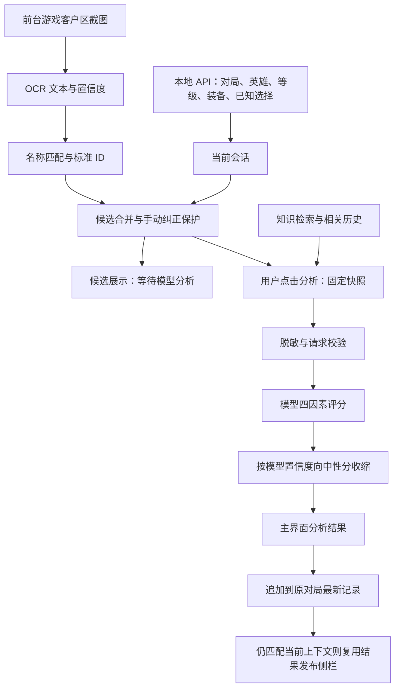

# Hexglow 算法匹配说明与本次修复记录

日期：2026-10-07。对应 Hexglow **0.0.1** 的当前源码；不表示本轮修改已安装或完成真实对局验收。

本文说明候选如何匹配、推荐如何计算，以及本次修改解决了哪些问题。新推荐分数表示模型的相对契合判断；模型置信度和知识种子尚未经过真实对局结果校准。第 3 节只保留旧规则模块说明，不是当前推荐路径。

## 1. 自动识别与主动模型推荐

| 路径 | 触发方式 | 使用信息 | 输出 |
|---|---|---|---|
| 自动本地识别 | 有效对局轮询后尝试 OCR | 游戏客户区文字、名称匹配与标准效果字典 | 保留候选顺序，显示“已识别 · 待模型分析”，不提供固定适配分 |
| 手动模型分析 | 用户配置模型、确认发送数据后点击分析 | 固定对局快照、双方英雄与已知海克斯、装备、候选效果文本、知识与相关历史 | 动态四因素判断、置信度、理由和风险；同一结果用于主窗口和当前侧栏 |



OCR 使用的 PP-OCRv6 Small 是本地文字识别模型，与用户配置的推理服务分开。自动识别不调用推荐模型，也不再自动按职业标签或已写好的英雄适配关系打分。推荐必须由用户主动发起，模型依据当次提供的英雄、装备、已知选择、双方阵容、效果、知识和历史动态判断；侧栏复用该次结果，不另行调用模型。重复识别、装备变化、知识保存或窗口重开不会自动增加收费请求。

主窗口直接显示等级、对局时间、客户端连接、最近同步和本人已选海克斯。只有匹配当前会话的有效实时快照才作为当前对局展示；大厅、断连、结束或历史回看时，保留资料明确标为历史，不开放本轮选择与推荐。实时状态与候选识别不依赖模型配置或外发同意；模型分析需单独配置并点击发起。切回主窗口导致前台截图跳过时，不把该跳过本身当作新一轮候选。

## 2. 候选匹配

### 2.1 截图与 OCR 来源

- 按窗口所属进程识别正式游戏 `League of Legends.exe`，排除客户端启动器。
- 自动截屏要求游戏位于前台、可见且非最小化；截屏后再次检查，期间切换应用则丢弃画面。
- 读取物理客户区中央约 62% 宽、52% 高的 RGB 区域，支持 DPI、副屏和负坐标，不经过 PNG 编码再解码。
- 无有效游戏画面时返回明确的 `skipped` 状态，不因跳过而额外加载模型、不更新画面缓存、不计识别统计。
- PP-OCRv6 Small 检测模型、识别模型和字典随安装包分发。构建前按清单验证 SHA-256 和大小，应用启动时从安装资源目录在后台预热；运行期间不下载模型，也不依赖开发机缓存。预热与扫描共用同一管线锁，避免重复加载。
- 完全相同的 RGB 画面在识别完成后五秒内可复用文本；画面变化立即重新识别。缓存命中仍需要先截屏比较。
- 指定文件路径的 OCR 属于独立诊断，不受游戏是否前台的限制，也不使用自动帧缓存。

当前实现随有效对局轮询持续尝试识别，不只在升级瞬间执行。等级档位按代码中的 `1、7、11、15` 划分，用于选择轮次状态；首个 `1` 是内部档位，不代表玩家在 1 级选择。界面显示第 1–4 轮，并另列实际观测等级；等级不直接增加推荐分。

### 2.2 名称归一与消歧

归一化保留 Unicode 字母和数字，忽略空白、标点并转为小写。匹配目录包含中文名称、英文 `nameEn` 和别名。

| 输入用途 | 规则 |
|---|---|
| 通用海克斯身份、已选列表、历史重叠 | 优先标准 ID，再精确名称；未精确命中时，允许至少四字符的完整名称出现在较长文本中 |
| 手填候选进入模型分析 | 只接受归一后的完整名称、别名或标准 ID；不从效果描述中的子串推断身份 |
| OCR 文本行 | 精确名称要求置信度至少 0.6；中文标题容错要求至少 0.75；只匹配整行名称，不接受效果描述中的包含匹配 |

通用身份解析中的包含匹配选择最长名称，避免把长名称及其短子串同时当作两个候选。最长命中若涉及等长的不同 ID，则认为歧义并丢弃。手填候选和 OCR 不采用这一包含匹配规则。

OCR 先对整行名称匹配，再校验卡片布局：

- 精确匹配支持中英文名称和别名。非有限或低于 0.6 的 OCR 置信度直接丢弃。
- 容错只处理置信度至少 0.75 的全中文标题。识别文本至少四字，且不能比标准名称长；四至七字标准名称最多允许一次字符替换或漏字，八字及以上最多两次。以最小编辑距离选取唯一身份；不同身份同距时丢弃。
- 三个标题需同一横排、字号高度相近、互不重叠且间距近似均匀，并至少有一个精确命中。不同位置的同名条目不算不同候选。
- 仅两个标题命中时，两者都必须精确，且附近须识别到受支持的稀有度或选择界面文字。仅一个命中不更新自动候选。
- 存在多组可能成立的布局时全部丢弃，不任意取前三个。只有唯一的一组才按从左到右返回两个或三个候选。

这套规则可排除说明文字中的名称、零散的已选列表和歧义标题，但不能证明所有布局都是实际选卡面板。它不使用语义检索，标准目录未收录的名称不能自动确认身份。OCR 自动候选的完整效果来自打包目录，不是对截图效果全文的自动核验。

### 2.3 候选槽位、手动纠正和实际选择

`candidate.id` 是模型响应关联候选的键。手填候选通常使用 `1、2、3` 等槽位 ID；OCR 候选则直接使用海克斯标准 ID。分析时按候选名称解析标准身份，另加 `augmentId` 并保留原 `id`，不把数字槽位误当作已确认的标准身份。

用户修改名称或效果时标记为 `manual`，递增候选修订号并使旧 OCR 请求失效。同等级档位内，新的 OCR 必须能与手动条目一致对应才能合并；不一致时拒绝覆盖。进入下一档位后可接受新候选，点击“重新识别候选”可主动释放保护。

模型结果展示绑定对局、等级档位、本人英雄与已选列表、本人装备、候选身份和效果文本。相关上下文变化会使旧推荐不再作为当前排名，但不会自动重发模型请求。模型结果先追加到发起分析的原局档案；只有仍匹配当前上下文时才发布到侧栏。手动纠正保留候选并释放旧结果的当前资格；重新识别仅解除手动保护。进入新档位但尚未识别新候选时，旧条目标为上一轮记录，并阻止用它们发起本轮分析。历史模型结果仍可回看，不冒充当前判断。

记录实际选择不要求先调用模型：当前轮候选可直接确认一次，保留 `manual-choice` 来源、时间与轮次，确认后锁定。同轮模型决策的候选身份和效果一致时，同步标注其选择；历史模型决策仍按原快照传播，不能借此更换当前轮选择。确认部分选择不会把全部海克斯标为已核实。

## 3. 保留的旧本地规则模块（不参与新推荐）

本节记录仓库仍保留的旧 `scoring.rs` 评分及其测试，便于理解旧版本行为；当前主窗口/侧栏不再调用它计算推荐，新模型请求与后处理也不调用其先验。名称识别仍复用基础字典的精确身份解析，不把下列职业标签、机制分或固定配对注入模型。

### 3.1 英雄画像

英雄匹配支持标准标识与名称别名，包括 `Wukong / MonkeyKing`、`Kai'Sa / Kaisa` 等形式。职业采用源数据 `tags` 中第一个受支持的职业，不把多职业英雄的所有职业奖励累加。

法力适配仅在 `partype` 明确为“法力”或大小写无关的 `Mana` 时成立。明确的其他资源类型不获得法力标签加分；空资源类型保持未知。混合效果中的其他标签仍可得分。

攻击距离不用于统一的近战扣分或远程奖励。由 Data Dragon 的 `info.attack / info.magic` 推断的伤害倾向只作为元信息和警告，不用于扣分，也不能证明技能或出装的收益。

技能机制画像目前只定向补充了艾克，来源为 [Riot 官方英雄页](https://www.leagueoflegends.com/en-us/champions/ekko/)和 [Data Dragon 16.19.1 艾克资料](https://ddragon.leagueoflegends.com/cdn/16.19.1/data/zh_CN/champion/Ekko.json)。可确认的事实包括：P 由同目标第三次普攻或伤害技能触发；Q 有去程和回程伤害；W 的低生命目标攻击附伤与主动护盾/控制；E 强化下一次攻击。画像标签为 `spell-damage / returning-projectile / empowered-attack / conditional-attack-damage / self-shield / hard-cc`，不表示每个标签都有独立加分。

没有官方证据确认的“虚幻武器额外叠三环、自动触发 W/E、递归循环”等交互不作事实、不加专属分；未展开的官方 tooltip 变量也不作为数值依据。其他英雄缺少机制画像时，技能协同项不加分并提示缺失，不能把缺失解释为不适配。

### 3.2 计算公式

```text
职业项 R = 已有定向海克斯机制规则时为 0，否则 min(职业标签分, 26)
机制项 H = 按实现顺序累加已满足的机制贡献，总计最多 40
L = clamp(50 + R + 类别分 + 稀有度分 + H, 0, 100)
已拥有该海克斯时：L = 0
```

当前没有额外的近战、攻速、暴击、射程或 AP/AD 不匹配扣分项。本地分使用已收录的英雄机制、本人装备和已选组合，但不评估双方完整阵容、游戏时间或实际战斗过程。等级只标记轮次。定向机制海克斯不再叠加粗职业标签分，避免把“施加攻击特效”或“按 AP 缩放”误算成直接获得攻击属性或 AP。

未收录定向机制规则的海克斯使用以下职业回退奖励，总和最多计 26 分：

| 主职业 | 匹配标签 | 每项奖励 |
|---|---|---:|
| Marksman（射手） | `crit / as / onhit / ad` | 12 |
| Mage（法师） | `ap / ultimate / mana / haste / cc` | 11 |
| Tank（坦克） | `tank / hp / sustain / cc` | 13 |
| Assassin（刺客） | `ad / ap / mobility / ultimate / haste` | 11 |
| Fighter（战士） | `ad / sustain / as / hp` | 10 |
| Support（辅助） | `cc / summoner / haste / utility` | 11 |

其中 `mana` 还必须满足明确使用法力的条件。`utility` 是评分函数支持的标签，具体候选能否命中取决于打包数据中实际存在的标签。

类别奖励：

| 主职业 | 类别 | 奖励 |
|---|---|---:|
| Marksman | `damage / utility` | 8 / 4 |
| Mage | `damage / utility` | 8 / 6 |
| Tank | `defense` | 12 |
| Fighter | `defense / damage` | 6 / 6 |
| Support | `utility` | 12 |
| Assassin | `damage` | 10 |
| 任意职业或未知职业 | `economy` | 4 |
| 其余组合，包括未知英雄 | 其他类别 | 2 |

稀有度奖励：`prismatic` 棱彩 +5、`gold` 黄金 +3、`silver` 白银 +1，其他 +0。

因此，未知英雄不会凭空得到职业或技能奖励，但仍可得到默认类别、稀有度和实际装备支持的机制分，不保证恰好为 50。加入机制项后输出上限为 100，不再以旧公式的 93 为上界。排序按分数降序，同分按标准 ID 的字符串升序。

代码回归示例：海克斯“由心及物”（标准 ID `1056`）对阿狸的本地分为 64，对凯南、弗拉基米尔为 53；差别来自法力标签适配。非法力英雄不会因此让整个候选归零。

### 3.3 效果标签的语义边界

标签由效果原文的关键词规则推导，先屏蔽能明确判断方向的负面、代价或条件短语。当前规则屏蔽“你造成的伤害降低…”、“对敌方英雄造成伤害后”等明确短语；“护甲击碎”归入破甲相关标签而非自身防御，“不能使用你的终极技能”不提供终极技能标签。规则不保证理解这些短语的所有改写形式。

本轮在已有标签修复基础上，进一步明确两条易误读数据：

- `1029` 虚幻武器：标签仅 `onhit`，类别 `utility`。原文的每目标冷却是自身触发限制，不是提供技能急速，不能加 `haste` 分。
- `1180` 超强大脑：类别为 `defense`，保留与 AP 缩放有关的 `ap / sustain` 标签，但不因此获得职业 AP 奖励。AP 是护盾缩放输入，不是直接获得 AP 或输出伤害；护盾重置间隔也不是技能冷却缩减。

海克斯完整效果沿用现有目录来源与 `verified / conflicts` 状态，包括尚未经过游戏内核验的数据。定向规则并不使这些效果自动成为官方已核验事实。原文、标签、机制推断与权重必须分开看待。

### 3.4 有限机制目录、装备和已选组合

机制规则须同时匹配当前打包数据补丁与完整效果原文，候选、已选协同和融合先验使用同一门槛。版本或原文失配即停用旧规则并提示，不仅凭 ID 继承旧联动。重新抓取基础资料会从独立官方技能快照源补回已收录字段；基础资料升级到另一补丁时保留旧来源说明、清空未经新补丁复核的英雄评分 traits。知识生成及统计导入的三份定向修正均有离线重建回归保护。

当前覆盖是部分覆盖（`curated-partial`），不是完整英雄/装备交互引擎：

| 范围 | 当前目录 |
|---|---|
| 英雄基础资料 / 定向技能画像 | 173 位基础资料；仅艾克有定向技能画像 |
| 海克斯基础资料 / 定向机制 | 211 个基础条目；5 个定向机制：`1029 / 1036 / 1058 / 1180 / 2016` |
| 装备基础属性 | Data Dragon 16.19.1 的 276 个已知物品 ID，其中 59 个有基础 AP 值 |
| 已检查攻击特效 | 7 件：反曲之弓、智慧末刃、纳什之牙、破败王者之刃、鬼索的狂暴之刃；巫妖之祸和三相之力单列为有条件的咒刃 |

装备依据 [官方 Data Dragon 16.19.1 物品资料](https://ddragon.leagueoflegends.com/cdn/16.19.1/data/en_US/item.json)，机制清单位于 [scoring-mechanics.json](../src-tauri/data/scoring-mechanics.json)。接受 `itemID / itemId / id` 或数值 ID；零数量忽略，单格数量最多按 6 计。重复同 ID 装备不会重复增加攻击特效机制分；未知 ID 不按显示名称或外部传入属性猜测效果，也不代表该装备没有效果。

下表为当前启发式加分，不是实际伤害、护盾量、胜率或官方强度评价：

| 候选机制与已满足条件 | 贡献 |
|---|---:|
| 技能施加攻击特效；英雄画像已记录伤害技能 | +5 |
| 同上；已记录去程/回程伤害机会 | +3，不推断实际触发次数 |
| 同上；装备已收录的常规攻击特效物品 | 首种 +16，每额外一种 +3，最多 +22 |
| 同上；装备已收录的咒刃物品 | +6，附先施法、强化攻击及自身限制警告 |
| 同上；已选明确提供攻击特效收益的海克斯 | 每种 +10，最多 +20；需要法力的效果必须满足资源条件 |
| 候选提供攻击特效收益；已选技能施加攻击特效的海克斯 | +12 |
| 候选提供攻击特效收益；英雄画像有强化攻击场景 | +4，不表示已核实特殊技能联动 |
| 候选为 AP 缩放护盾；已观测装备基础 AP 合计 A > 0 | `min(4 + floor(A / 20), 16)` |

机制项按上表对应代码分支顺序消耗 40 分预算，后续贡献会被截断；`mechanismContributions` 输出实际计入的分数、理由与来源。已拥有候选最终归零并清除机制贡献。已选别名和 ID 先归一去重，不能重复计分；需要法力的 `2016` 在资源不满足或未知时不计攻击特效协同。

基础 AP 合计只覆盖物品表的固定值，不含层数、被动乘区、符文、模式修正，不等于面板 AP，也不据此算最终护盾。鬼索仅使用已收录的基础攻击特效，不推断技能会累计普攻次数或额外触发叠层被动。咒刃不能解释为每次技能命中都触发。

返回的 `contextCoverage` 记录技能画像是否存在、观测装备条目数、已知属性条目数、未知装备 ID、基础 AP 合计、来源和版本。这里的“已知属性”不代表完整装备机制已覆盖。当前只对明确目录和条件加分；其余沿基础分类或职业规则回退并提示缺失。

回归用例会比较同一艾克候选组在纳什之牙与灭世者的死亡之帽等不同装备下的排序变化，验证装备确实参与计算；它不证明某组合实战更强，也不把“艾克必须选虚幻武器”硬编码为结论。

## 4. 动态模型评分与未知保护

### 4.1 请求条件和信息

分析前要求能识别当前玩家和双方阵营、玩家英雄及有效的海克斯数组；推荐至少有两个候选，每个候选 ID 唯一、名称和效果文本非空。这只能检查文本存在，不能证明效果内容完整。合法的部分会话可以保存和展示，但信息不完整时仍阻止分析。

请求使用点击时的固定快照，并附带已知阵容、装备、候选、相关知识和历史。未经识别的海克斯保持未知，不把“没识别到”解释为“没有”。历史用于提示参考，不训练权重。

外发前去除原始 API 数据、玩家名称和对局 ID，玩家身份改为 `p1` 等代号，保留实际观测到的游戏版本。自由文本仍需用户自行检查。

新请求不计算或注入 `localScore / localReason / localRisks / priorReliability`、职业标签、分类、固定技能画像及机制贡献；调用方夹带的旧候选评分字段也会剥离。保留当次候选名称和完整效果，绝不以目录效果覆盖手动文本。打包字典只补精确 `augmentId` 和根据本人已知选择重新计算的 `alreadyOwned`，不是适配证据。返回候选 ID 必须与本次请求一致。

原始分析上下文最多 8 MiB；脱敏后的模型状态最多 256 KiB，响应最多 1 MiB，请求超时 30 秒。必需事实超出预算会报错，不静默删除后继续推理。

### 4.2 四因素与模型均值

| 字段 | 含义 |
|---|---|
| `championSynergy` | 当前英雄协同 |
| `buildSynergy` | 出装协同 |
| `teamFit` | 队伍适配 |
| `enemyFit` | 敌方适配 |

模型必须返回四项分数 `sᵢ`，每项为 0–4 的数字。置信度 `cᵢ` 可省略；若提供，必须为 0–1 的数字。省略按 0 处理，响应中的 `null` 不作为合法置信度。

```text
T = c₁ + c₂ + c₃ + c₄
M = T > 0 时：25 × Σ(sᵢ × cᵢ) / T
当 T = 0 时：M = 50
C = T / 4
```

零置信度或缺失置信度的因素完全退出模型均值 `M`，但仍占整体置信度 `C` 的四分之一。因此，一个已知因素评分高不会被另外三个未知因素直接拉低；同时，信息缺口会降低模型对最终分的影响。

### 4.3 不再混合固定先验

新决策使用 `engine.scoringMode = dynamic-model-v1`。缺失机制、未核验知识和未知因素应由模型明确保留不确定性；不会再用预设职业分、英雄画像分或个人规则加减分填补证据缺口。模型只能依据提供的资料，不能把草稿或推断当成已核验事实。

旧档案不迁移、不重算，保留生成当时的结果和解释。新结果保留兼容字段 `localScore: null`；`modelWeight` 仅表示整体模型置信度，不再代表与本地评分的混合比例。读取旧上下文时也剥离候选旧评分字段，不让它们成为当前固定先验。

### 4.4 最终公式与示例

```text
α = C
F = α × M + (1 − α) × 50
已拥有该候选时：F = 0
```

`α` 是整体模型置信度，`F` 是向中性收缩后的相对契合度。不再存在本地分 `L` 或先验可靠性 `r`；全部因素未知时内部值为 50，而非静态规则高分。

| 情况 | M | C = α | 最终 F |
|---|---:|---:|---:|
| 只有一项 `score=4, confidence=1`，其余未知 | 100 | 0.25 | 62.5 |
| 三项 `score=4, confidence=1`，其余未知 | 100 | 0.75 | 87.5 |
| 四项全部未知，即使旧上下文夹带本地高分 | 50 | 0 | 50.0 |
| 分数为 4、3、2、1，置信度均为 1 | 62.5 | 1 | 62.5 |
| 已拥有候选，即使模型高分 | 任意 | 任意 | 0.0 |

后端结果将已拥有候选标记 `alreadyOwned: true` 并排到可选项之后；其余按最终分保留一位小数后降序排序，同分保持请求顺序。当前展示还需确认结果来自新动态模型、候选完整匹配且每项达到置信度与依据门槛；不满足时整组不显示分数与名次。整体置信度展示保留两位小数，模型权重保留计算值。置信度来自 Jev 服务时标记 `provider`，来自普通模型时标记 `self_reported`，全部未提供时标记 `unavailable`；均不是经过真实对局校准的概率。

### 4.5 解释与引用

普通模型可以返回逐因素 `reason` 和 `references`。提示要求简短解释不超过 50 字；后端校验上限是 400 字，每项最多八个引用、每个最多 256 字符。零置信度因素的解释和引用不展示。

引用只接受本次提供的文档路径，以及返回的 `sections` 清单或正文中的有效 Markdown 标题。正文标题扫描排除代码围栏、四空格或制表符缩进代码中的伪标题；`sections` 清单则直接作为允许章节使用。当前知识裁剪解析对波浪号围栏和缩进代码处理不完整，伪标题仍可能进入清单，因此不能保证所有引用章节都通过同样严格的正文检查。未知路径和章节会忽略并提示。

界面区分“模型实际返回的引用”和“提供给模型但未逐项引用的参考文档”。文档路径匹配只确认来源存在，不验证解释的机制结论；解释会附未核验提示。新决策不再计算模型与固定本地分的分歧。

## 5. 知识与历史匹配

知识按英雄、候选和已选海克斯精确检索，沿一层链接补充，最多提供 16 份文档、64 KiB 内容。整篇放不下时按章节裁剪，输出保留章节和缺失、裁剪、版本警告。

单文档有界读取并复用未变化内容的 YAML 解析；外部编辑即使保留大小和修改时间也会刷新。坏 UTF-8 或超限文档单独隔离。检索指纹包含实际文档内容、缺失信息和警告，版本未知的提示也会影响指纹。指纹用于缓存一致性，不是密码学完整性证明。

生成知识升级仅在旧内容哈希精确匹配时更新，保留用户编辑、已删除文档和备份。当前有 173 位英雄、211 个海克斯的种子；艾克新增技能字段有上述官方版本来源，海克斯仍保留各自的数据质量标记。不能把生成完成等同于全部机制已通过游戏内核验。

历史匹配在最近 200 条有内容的档案中排除当前会话：

本人已选列表先过滤非字符串和空字符串，再取前六条进行归一。

```text
A = 当前候选 ID、名称各自可归一的标准 ID ∪ 本人已选前六条记录中可归一的标准 ID
H = 历史中实际选择可解析的标准 ID ∪ 当局本人已选前六条记录中可归一的标准 ID
Jaccard(A,H) = |A ∩ H| / |A ∪ H|；并集为空时为 0
```

同英雄优先，其次按 Jaccard 相似度，再按时间倒序；通常取五条。“同英雄”目前按英雄字符串严格相等判断，不进行别名归一。没有同英雄、没有重叠且没有复盘的记录不作为参考。

历史选择优先按该轮决策快照还原，不把当时未选择的候选计入实际选择。旧记录缺少快照时，回退到会话候选或选择 ID，不能保证所有旧档案都能准确还原原轮次。当前候选的 ID 与名称分别归一；若 OCR 标准 ID 与手动改名后的身份冲突，可能同时纳入两个 ID，扩大当前集合。

SQL 在读取前裁掉重型采样和决策大上下文，随后生成有界摘要；完整原始证据仍保存在档案详情。无法归一的文本和候选槽位 ID 不参与海克斯重叠计算。

### 5.1 赛后证据恢复

结算补取只用于已结束或已归档、具有数字对局 ID 的记录。客户端的结算数据、按 ID 查询的比赛历史及最近历史均须与目标局严格对应；缺少或冲突的局 ID 不靠英雄或姓名猜测归属。已归档但漏采结束阶段的旧局允许补取，以归档观察时间作为重试窗口锚点，不伪造结束时刻或胜负。

自动队列最多保留 3 局，每局在结束/归档观察后的 10 分钟内最多尝试 8 次。首次至少等待 3 秒，此后按 6、12、24、48、60 秒的退避间隔继续，单次间隔最多 60 秒；阶段暂停或繁忙可能推迟执行，窗口到期不无限重试。完成或显式删除会移除目标；打开缺资料的档案或手动补录属于额外的用户触发请求。

补取为独立单飞任务，不在实时 `poll()` 内等待，不占住采集锁。`InProgress / ChampSelect / GameStart / Reconnect` 不启动新的自动补取；大厅发出的请求即使迟到，也只合并原局档案，不阻塞下一次实时采集和 OCR，不把旧局快照发布为当前局。

回包后先等待已有保存队列，再重读该目标的最新内存记录或档案，旧局不信任详情页缓存，保留期间新增的笔记、实际选择与分析。保存成功后才发布补录结果及完成重试；保存期间发生变化会有限次重基合并，失败继续保留重试目标。手动补录先处理尚未触发的笔记延迟保存，防止旧快照覆盖结算。删除、退出、分析或其他数据操作改变请求代次后，未发起保存的旧回包不再落盘；已进入保存队列的写入仍遵守其顺序，删除会等待队列完成。海克斯按可靠玩家身份匹配后做并集补齐；只有已匹配证据才标为核实。匹配的官方胜负可替代手动结果或未知值，但不会让矛盾的迟到结果覆盖已记录的自动胜负。已存原始赛后证据不被后续不完整响应替换。客户端无对应证据时保持未知，不因断线判负。

## 6. 本次修复内容

| 范围 | 修复后的行为 | 主要实现 |
|---|---|---|
| 候选身份匹配 | OCR 整行标题匹配、中文有限容错与唯一布局验证；精确/容错置信度分别为 0.6/0.75；手填槽位通过名称解析到标准 ID | [scoring.rs](../src-tauri/src/scoring.rs)、[decision.rs](../src-tauri/src/decision.rs) |
| 元数据语义 | 区分收益、代价和触发条件；1029 不把触发间隔当急速，1180 按防御和 AP 护盾缩放处理，同步生成知识 | [data-tags.mjs](../scripts/data-tags.mjs)、[augments.json](../src-tauri/data/augments.json) |
| 英雄与装备适配 | 保留职业回退与法力判定；补充官方艾克画像、有限装备/已选机制；贡献最多 40 分，缺失项明确回退，不虚构特殊联动 | [scoring.rs](../src-tauri/src/scoring.rs)、[scoring-mechanics.json](../src-tauri/data/scoring-mechanics.json) |
| 已选海克斯 | 名称和标准 ID 均能识别重复；按原决策快照传播实际选择，保留后续手动纠正与部分未知 | [domain.ts](../src/domain.ts)、[scoring.rs](../src-tauri/src/scoring.rs) |
| 动态模型与未知因素 | 不注入或融合固定适配分；未知不参与模型均值、整体证据不足向中性收缩；精确候选 ID、已拥有排除、旧档案兼容 | [decision.rs](../src-tauri/src/decision.rs) |
| 请求事实与来源 | 保留实际版本和画像警告；外发不含本地分；按实际脱敏状态核算请求预算；区分置信度来源 | [decision.rs](../src-tauri/src/decision.rs) |
| 解释与引用 | 支持有界解释；校验本次路径及允许章节；正文标题扫描过滤伪标题；忽略未知引用；参考文档不冒充模型引用，章节清单仍有第 4.5 节所述限制 | [decision.rs](../src-tauri/src/decision.rs)、[Ranking.tsx](../src/Ranking.tsx) |
| 截屏与 OCR | 定位真实前台游戏客户区；支持 DPI 和多显示器；直接 RGB 区域截屏；复用相同画面，跳过状态不污染统计 | [capture.rs](../src-tauri/src/capture.rs)、[ocr.rs](../src-tauri/src/ocr.rs) |
| 离线模型与首轮准备 | 安装包包含固定哈希的模型和字典；启动时异步预热；缺失或不完整时提示重装，运行时不下载 | [ocr.rs](../src-tauri/src/ocr.rs)、[模型清单](../src-tauri/resources/ocr/manifest.json)、[prepare-ocr-models.ps1](../scripts/prepare-ocr-models.ps1) |
| 手动纠正与迟到 OCR | 同档位保护手动候选；修订号作废旧扫描；增加主动重新识别入口 | [candidates.ts](../src/candidates.ts)、[LiveOverview.tsx](../src/LiveOverview.tsx)、[main.tsx](../src/main.tsx) |
| 主窗口实时显示 | 实时状态和本地评分直接显示，不依赖模型配置；恢复同档 OCR 候选可直接重算；上下文变化使旧分失效，上一轮候选明确标记 | [LiveOverview.tsx](../src/LiveOverview.tsx)、[liveRecommendation.ts](../src/liveRecommendation.ts)、[main.tsx](../src/main.tsx) |
| 侧栏状态 | 先缓存再发布，监听就绪重放；后端单调序号；关闭先清空；迟到的创建窗口或状态不能恢复旧推荐 | [overlay.rs](../src-tauri/src/overlay.rs)、[OverlayApp.tsx](../src/OverlayApp.tsx) |
| 模型期间采集与跨局 | 分析固定快照，采集继续；分析期间暂停 OCR；结果合并回原局最新状态，保留结束证据和新增采样 | [analysis.ts](../src/analysis.ts)、[main.tsx](../src/main.tsx) |
| 迟到结算恢复 | 严格局 ID、有限退避、独立单飞不阻塞 OCR；回包重读最新基准；删除/退出/分析作废旧请求；不凭空补胜负 | [postgameRecovery.ts](../src/postgameRecovery.ts)、[collector.rs](../src-tauri/src/collector.rs)、[postgame-recovery.test.mjs](../scripts/postgame-recovery.test.mjs) |
| 保存顺序与请求次数 | 单进程写入串行、合并同局待写快照；超时仍等真实写入结束；模型失败和保存超时不能绕过已发起请求次数 | [saveQueue.ts](../src/saveQueue.ts)、[main.tsx](../src/main.tsx) |
| 桌面生命周期 | 单实例启动；关闭主窗口隐藏到托盘；托盘退出先保存，失败或超时则取消退出并提示 | [desktop.rs](../src-tauri/src/desktop.rs)、[main.rs](../src-tauri/src/main.rs) |
| 档案读取与维护 | 轻量 SQL 投影；有快照时按原轮次还原选择；维护前等待落盘、完成后重读；增量计算清理预算，避免旧内存数据重新写回 | [storage.rs](../src-tauri/src/storage.rs)、[main.tsx](../src/main.tsx) |
| 异常数据隔离 | 坏 JSON、非对象决策和结构错误档案不拖垮其余记录；前端校验完整记录与摘要；导出保留不可读记录原文 | [storage.rs](../src-tauri/src/storage.rs)、[sessionReader.ts](../src/sessionReader.ts) |
| 知识缓存与安全升级 | 按内容检测外部编辑；坏文档隔离；警告进入指纹；精确旧哈希升级并保留用户修改和删除 | [knowledge.rs](../src-tauri/src/knowledge.rs)、[seed-repair-hashes.json](../src-tauri/data/seed-repair-hashes.json) |
| 兼容接口与检查 | 旧 `analyze / test_model` 复用当前结构化实现；相关存储命令移出同步 UI 路径；CI 纳入前端测试 | [lib.rs](../src-tauri/src/lib.rs)、[windows.yml](../.github/workflows/windows.yml) |

保存超时只通知调用方，不取消后台写入。真正未结束的写入仍会阻塞后续保存、删除和维护，保证顺序；这是数据完整性与响应速度之间的取舍。

## 7. 验证范围与记录

本节保留此前修复轮次的验证记录，不将样本识别等同于完整实战验收。2026-10-07 较早轮次记录：前端与脚本 211 项通过，Rust 163 项通过、1 项真实窗口测试未执行；当时 TypeScript/Vite 生产构建、Rust 格式检查和差异空白检查通过。此处不是本次动态模型调整后的最终测试数；当前检查结果以实际执行记录为准。没有据此宣称当前源码已打包、安装或实战通过。

| 检查 | 结果与范围 |
|---|---|
| 前端与数据标签测试 | 覆盖选择传播、候选保护、保存队列、跨局结果、装备缓存失效、档案读取、标签回归、生命周期与更新签名；新增从实际主程序回调提取的结算补取并发测试 |
| Rust 测试 | 覆盖机制贡献与上限、装备和已选变化、未知回退、融合、知识升级、存储、截图状态、离线 OCR、结算 ID/身份和错误路径；真实前台游戏测试单独标记 ignored，不计作常规通过项 |
| 构建与格式 | 上述历史轮次的 TypeScript/Vite 构建、`cargo fmt --check` 和 `git diff --check` 通过，不代替本次检查 |
| 模型准备 | 既往清单内三个文件通过大小及 SHA-256 校验；本轮构建仍需按清单重新校验，不能以开发机缓存代替资源完整性 |
| 界面烟测 | 既往浏览器预览的设置与知识界面可打开且无控制台警告或错误；不代表本轮修改的 Tauri 端到端验收 |
| OCR 样本 | 已有文件样本使用内置资源模型测试三个指定候选和标题布局；不代表当前真实选择面板已被验证 |
| 既往真实通路观测 | 此前曾只读验证游戏客户区截屏和 OCR，单次识别观测约 0.55–0.65 秒；该观测不代表本轮新版本完整实战验收 |

真实通路验证时没有候选选择面板，因此没有完成真实选卡到确认选择的完整验收。耗时只是本机当时的观测，不代表固定延迟或相对旧版的加速比例。

可复现检查：

```sh
pnpm test
pnpm build
pnpm prepare:ocr
cargo fmt --manifest-path src-tauri/Cargo.toml -- --check
cargo test --manifest-path src-tauri/Cargo.toml --locked
```

模型准备步骤可能联网；之后 OCR 测试与已安装应用使用本地模型。真实窗口测试需专门选择 `--include-ignored`，根据现场条件验证捕获或明确跳过状态。

## 8. 当前限制与后续优化方向

- 新推荐不采用旧模块中的固定职业、稀有度或技能适配加分。模型依赖当次上下文与所提供知识，知识缺失、未核验或版本过旧仍可能导致不确定或错误判断。
- 第 3.4 节的旧机制目录只是历史实现范围，不代表模型已经理解或证实所有交互。模型依据不足时应降低置信度，显示端保留候选和缺口，不把未知解释为真实收益为零。
- OCR 标题布局验证仍不能保证识别所有游戏界面。连续两次有效截图未识别到足够候选时关闭旧侧栏；单纯切换前台造成的跳过不算面板消失。缺失实时对局数据时也关闭侧栏，但保留历史候选。以上是有限状态保护，不等于能识别所有面板消失情形。
- 手动修改效果会保护候选并用于下一次主动分析；旧模型结果不能冒充改动后的当前推荐，也不会因为修改文本自动产生新的收费请求。
- 历史匹配仍有英雄别名、候选身份冲突和旧记录缺失快照的限制；知识裁剪后的章节清单也需统一采用严格的 Markdown 标题解析。
- 置信度尚未校准。需要积累经核验的案例，评估匹配准确率、解释正确率和排序稳定性，而不是将展示置信度当作真实成功率。
- 正常启动已限制为单实例，重复打开会恢复原窗口。`SaveQueue` 仍只协调进程内部的写入；外部程序直接修改数据库不属于其协调范围。
- 有限的单元测试、文件样本和只读游戏通路验证还不能替代完整选卡流程、多分辨率与长时间运行验证。
- 结算恢复依赖客户端实际返回可归属证据；补取次数、时间窗和身份校验均有限，不保证每局能补齐。缺失信息继续按未知展示。

后续优先级建议：真实选卡与结算链路验收 → 扩充并核验英雄、装备及海克斯机制覆盖 → 真实案例回归与置信度校准。修改算法时应同时更新本文公式、规则表与对应回归用例。
